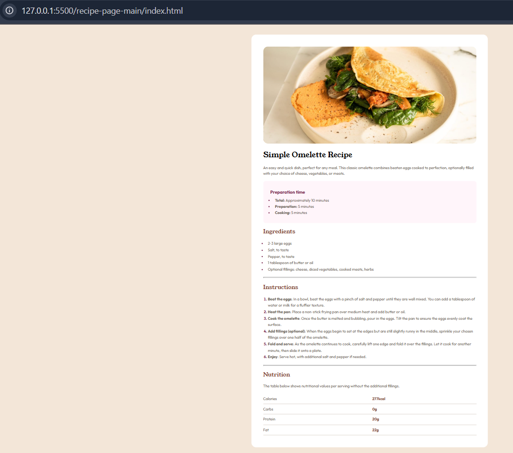

# Frontend Mentor - Recipe Page

## Welcome! 👋

Thanks for checking out my solution to the **Recipe Page** challenge on [Frontend Mentor](https://www.frontendmentor.io).  

This challenge helps improve frontend skills by building realistic projects using HTML and CSS.

---

## The Challenge

The task was to build a responsive recipe page that closely matches the provided design.  
I focused on using semantic HTML, a mobile-first approach, and styling with CSS to replicate the colors, typography, and layout from the design.

---

## Screenshot

---

## Live Demo

Check out the live version here: [Live Demo](https://your-live-site-url.com)  

---

## Where to Find Everything

All project assets, including images and fonts, are in the `/assets` folder.  
The design files (mobile and desktop) were provided as JPGs in the `/design` folder.  

I also referred to the `style-guide.md` file to implement the correct color palette, fonts, and typography.

---

## Built With

- **HTML5** - semantic structure  
- **CSS3** - Flexbox, Grid, custom properties  
- **Mobile-first workflow** for responsive design  

---

## Features

- Fully responsive layout for mobile and desktop  
- Semantic and accessible HTML structure  
- Clear typography hierarchy and color palette matching the design  
- Optimized images and clean layout  

---

## What I Learned

- Structuring HTML for semantic content sections (preparation, ingredients, instructions, nutrition)  
- Implementing responsive design using Flexbox and Grid  
- Styling lists, tables, and headings to match a design guide  
- Organizing project files and assets for clarity  

---

## Author

- Frontend Mentor - [@asha-16](https://www.frontendmentor.io/profile/asha-16)  
- GitHub - [asha-16](https://github.com/asha-16)  

---

## Acknowledgments

- [Frontend Mentor](https://www.frontendmentor.io) for providing the challenge  
- All the tutorials and articles I referenced for CSS layout and typography
